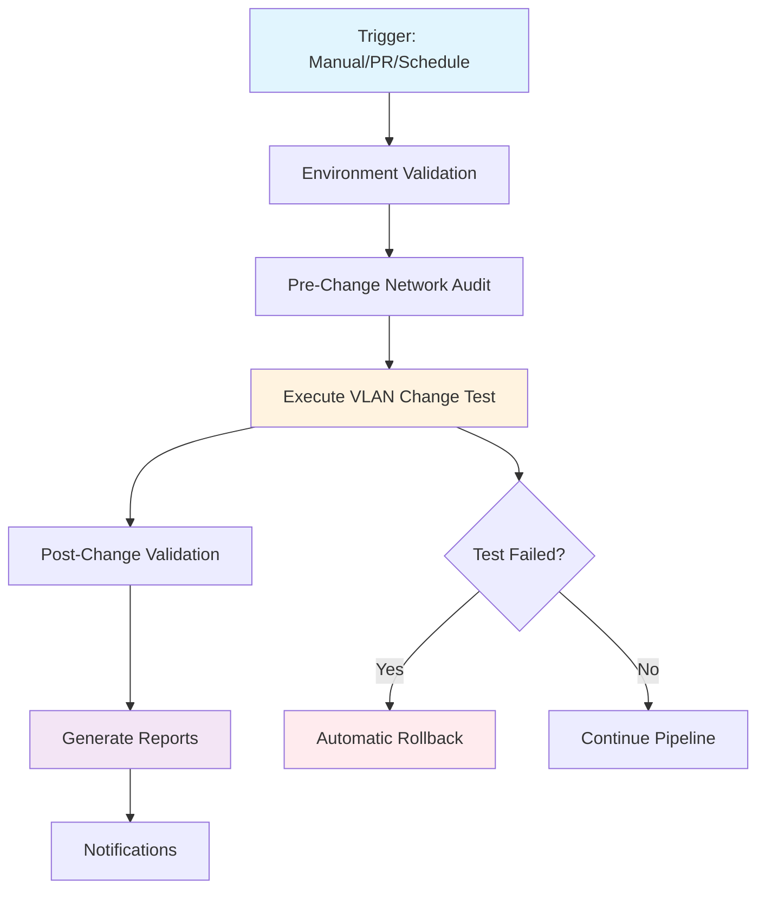

# 🚀 Network CI/CD Pipeline Setup Guide

This guide walks you through setting up and using the comprehensive GitHub Actions CI/CD pipeline for automated network VLAN change testing and validation.

## 📋 Table of Contents

1. [Overview](#overview)
2. [Prerequisites](#prerequisites)
3. [Initial Setup](#initial-setup)
4. [Configuration](#configuration)
5. [Running Tests](#running-tests)
6. [Understanding Results](#understanding-results)
7. [Troubleshooting](#troubleshooting)
8. [Best Practices](#best-practices)

## 🎯 Overview

The Network CI/CD pipeline provides automated testing and validation for VLAN changes across your lab environment. It ensures that:

- **Pre-change state** is captured and documented
- **Changes are applied** safely and correctly
- **Post-change validation** confirms the expected outcome
- **Side effects** are detected and reported
- **Rollback** is performed automatically on failure
- **Comprehensive reports** are generated for analysis

### Pipeline Architecture



## 📋 Prerequisites

### Network Environment

- **Lab Setup**: 1 core switch, 2 edge switches, 3 clients (as described)
- **Network Access**: GitHub Actions runner must reach all devices
- **SSH Access**: All network devices accessible via SSH
- **Credentials**: Valid authentication for all devices

### GitHub Repository

- **GitHub Repository** with Actions enabled
- **Secrets Management** for storing credentials
- **Proper Permissions** for GitHub Actions

### Device Requirements

- **Cisco IOS** devices (or compatible)
- **SSH enabled** on all devices
- **Enable mode access** for configuration changes
- **VLANs configured** and available for testing

## 🔧 Initial Setup

### 1. Repository Structure

Ensure your repository has this structure:

```
Vlan-Changer/
├── .github/
│   └── workflows/
│       └── network-ci-cd.yml
├── inventory/
│   ├── devices.yml
│   └── targets.yml
├── tests/
│   ├── network_audit.py
│   ├── test_vlan_e2e.py
│   └── helpers.py
├── scripts/
│   └── generate_report.py
├── VlanChange.py
├── requirements.txt
└── docs/
    └── CI-CD-SETUP.md
```

### 2. Configure Device Inventory

Edit `inventory/devices.yml` with your lab devices:

```yaml
devices:
  core1:
    host: 192.168.1.197  # Your core switch IP
    device_type: cisco_ios
  edge1:
    host: 192.168.1.198  # Your edge switch 1 IP
    device_type: cisco_ios
  edge2:
    host: 192.168.1.199  # Your edge switch 2 IP
    device_type: cisco_ios
```

### 3. Configure Test Targets

Edit `inventory/targets.yml` for default test configuration:

```yaml
# Default test target configuration
target:
  device: edge1                    # Which device to test
  interface: GigabitEthernet0/1   # Which interface to modify
test_vlan: 20                     # Safe VLAN ID for testing
```

### 4. Set Up GitHub Secrets

In your GitHub repository, go to **Settings > Secrets and variables > Actions** and add:

#### Required Secrets

- `NETWORK_USERNAME` - Primary SSH username
- `NETWORK_PASSWORD` - Primary SSH password

#### Optional Fallback Credentials

- `FALLBACK_USER1` - First fallback username
- `FALLBACK_PASS1` - First fallback password
- `FALLBACK_SECRET1` - First fallback enable secret (optional)
- `FALLBACK_USER2` - Second fallback username
- `FALLBACK_PASS2` - Second fallback password
- `FALLBACK_SECRET2` - Second fallback enable secret (optional)

> **Security Note**: Never commit credentials to your repository. Always use GitHub Secrets.

## ⚙️ Configuration

### Environment Variables

The pipeline uses these environment variables (set via GitHub Secrets):

| Variable | Purpose | Required |
|----------|---------|----------|
| `PRIMARY_USERNAME` | Main SSH username | ✅ Yes |
| `PRIMARY_PASSWORD` | Main SSH password | ✅ Yes |
| `FALLBACK_USER1` | Backup username 1 | ⚠️ Recommended |
| `FALLBACK_PASS1` | Backup password 1 | ⚠️ Recommended |
| `FALLBACK_SECRET1` | Enable secret 1 | ❌ Optional |

### Device Configuration

For reliable testing, ensure your network devices have:

1. **SSH Access**: 
   ```cisco
   ip ssh version 2
   username admin privilege 15 password cisco
   line vty 0 15
    login local
    transport input ssh
   ```

2. **Test VLANs Created**:
   ```cisco
   vlan 20
    name TEST_VLAN
   ```

3. **Interface Available for Testing**:
   - Use a non-critical interface
   - Ensure it's not connected to production traffic

## 🏃‍♂️ Running Tests

### Manual Execution

To run tests manually with custom parameters:

1. Go to **Actions** tab in your GitHub repository
2. Select **Network VLAN Change CI/CD Pipeline**
3. Click **Run workflow**
4. Fill in the parameters:
   - **Target Device**: `edge1`
   - **Target Interface**: `GigabitEthernet0/1`
   - **Target VLAN**: `20`
   - **Skip Rollback**: `false` (recommended for testing)
   - **Environment**: `lab`

### Automatic Triggers

The pipeline automatically runs on:

- **Pull Requests** to main branch (when network code changes)
- **Daily Schedule** at 2 AM UTC (health checks)
- **Manual Triggers** via GitHub Actions interface

#### Pull Requests on GitHub-hosted runners

PRs execute a safe "Static Checks" job only (syntax/import/YAML parsing). Network-reliant jobs are gated and will run on PRs only if a self-hosted runner with the `self-hosted` label is used. This avoids false failures when GitHub-hosted runners cannot reach your internal network.

To run full network tests on PRs:

- Configure a self-hosted runner with network access to devices
- Ensure the runner has the `self-hosted` label (default for self-hosted)
- Optionally, restrict the workflow to that runner with repository-level policies

### Local Testing

You can also run tests locally:

```bash
# Run environment validation only
python tests/test_vlan_e2e.py --validate-only

# Run full test with cleanup
python tests/test_vlan_e2e.py

# Run test without rollback (for inspection)
python tests/test_vlan_e2e.py --no-cleanup
```

## 📊 Understanding Results

### Pipeline Jobs

The pipeline consists of 6 main jobs:

1. **🔍 Environment Validation**
   - Tests connectivity to all devices
   - Validates credentials
   - Confirms test targets exist

2. **📋 Pre-Change Network Audit**
   - Captures current state of all devices
   - Documents port configurations
   - Creates baseline for comparison

3. **🔧 Execute VLAN Change Test**
   - Applies the target VLAN change
   - Verifies the change was applied correctly
   - Records any errors or warnings

4. **🔍 Post-Change Validation**
   - Re-audits all devices after changes
   - Compares before/after states
   - Identifies any unintended side effects

5. **📄 Generate Final Report**
   - Creates comprehensive documentation
   - Summarizes all pipeline results
   - Provides actionable insights

6. **📢 Send Notifications**
   - Alerts on failures
   - Confirms successful manual changes

### Artifacts Generated

Each pipeline run generates several artifacts:

- **Pre-Change Audit**: `pre_change_audit_TIMESTAMP.json`
- **Test Results**: `test_report_TIMESTAMP.md`
- **Test Logs**: `test_results.log`
- **Post-Change Validation**: `post_change_audit_TIMESTAMP.json`
- **Comparison Report**: `comparison_report.txt`
- **Final CI/CD Report**: `cicd_report_TIMESTAMP.md`

### Success Criteria

A test is considered successful when:

✅ All devices are accessible  
✅ VLAN change is applied correctly  
✅ Target interface shows expected VLAN  
✅ No unintended changes on other ports  
✅ Rollback completes successfully (if enabled)  

### Reading Test Reports

Test reports include:

- **Executive Summary**: High-level pass/fail status
- **Test Configuration**: What was tested
- **Detailed Results**: Step-by-step outcomes
- **Network Changes**: Before/after comparison
- **Recommendations**: Suggested actions

## 🔧 Troubleshooting

### Common Issues

#### 1. Authentication Failures

**Symptoms**: Connection timeouts, authentication errors

**Solutions**:
- Verify GitHub Secrets are set correctly
- Test credentials manually: `ssh username@device-ip`
- Check fallback credentials configuration
- Ensure devices allow SSH connections

#### 2. VLAN Configuration Errors

**Symptoms**: VLAN change fails, "VLAN does not exist" errors

**Solutions**:
- Verify test VLAN exists on target device: `show vlan brief`
- Create missing VLANs: `vlan 20` in config mode
- Check VLAN database consistency

#### 3. Interface Not Found

**Symptoms**: "Interface does not exist" errors

**Solutions**:
- Verify interface names in `targets.yml`
- Check device documentation for correct naming
- Use `show ip interface brief` to list interfaces

#### 4. Network Connectivity Issues

**Symptoms**: Timeouts, unreachable devices

**Solutions**:
- Verify network paths from GitHub runners
- Check device IP addresses in `devices.yml`
- Test connectivity: `ping device-ip`
- Verify firewall rules allow SSH

### Debug Mode

Enable debug logging by modifying the test script:

```python
# In test_vlan_e2e.py, change logging level
logging.basicConfig(level=logging.DEBUG)
```

### Manual Validation

To manually verify the pipeline setup:

```bash
# Test device connectivity
python tests/network_audit.py --devices inventory/devices.yml

# Validate test configuration
python tests/test_vlan_e2e.py --validate-only

# Run audit only
python tests/network_audit.py --report
```

## 🏆 Best Practices

### Security

1. **Never commit credentials** to the repository
2. **Use GitHub Secrets** for all sensitive data
3. **Rotate credentials** regularly
4. **Limit access** to the repository and devices
5. **Monitor audit logs** for unauthorized access

### Testing Strategy

1. **Test in lab first** before production
2. **Use safe VLANs** that won't impact services
3. **Run during maintenance windows** for production
4. **Keep rollback enabled** unless specifically needed
5. **Monitor test results** regularly

### Maintenance

1. **Update device inventory** when adding/removing devices
2. **Review test targets** periodically
3. **Check credential expiration** dates
4. **Update dependencies** in `requirements.txt`
5. **Archive old artifacts** to save space

### Monitoring

1. **Set up notifications** for pipeline failures
2. **Review weekly reports** for trends
3. **Monitor device performance** during tests
4. **Track success rates** over time
5. **Document issues** and resolutions

## 📚 Additional Resources

### Related Documentation

- [VLAN Changer README](../README.md) - Original tool documentation
- [GitHub Actions Documentation](https://docs.github.com/en/actions)
- [Netmiko Documentation](https://netmiko.readthedocs.io/)

### Example Commands

```bash
# Manual network audit
python tests/network_audit.py --devices inventory/devices.yml --report

# Compare two audit files
python tests/network_audit.py --compare before.json after.json

# Generate comprehensive report
python scripts/generate_report.py --artifacts-dir ./artifacts

# Run specific pytest tests
pytest tests/test_vlan_e2e.py::test_environment_connectivity -v
```

### Support

For issues or questions:

1. **Check the troubleshooting section** above
2. **Review pipeline logs** in GitHub Actions
3. **Test locally** to isolate issues
4. **Check device configurations** and connectivity
5. **Review audit reports** for additional context

---

*This documentation is maintained as part of the Network CI/CD Pipeline project. Last updated: 2024*
