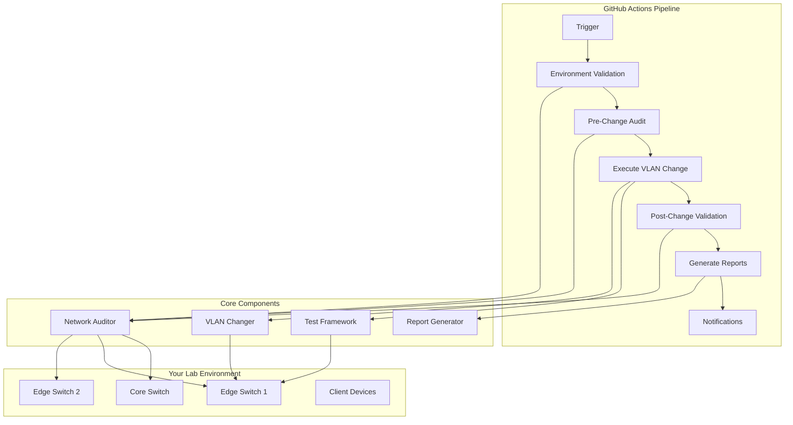

# 🎯 What We Built: Complete GitHub Actions CI/CD Pipeline for Network Testing

## 📋 Executive Summary

We've transformed your basic VLAN changer script into a **comprehensive network CI/CD pipeline** that automates testing, validation, and reporting for network changes. Here's what you now have and why each piece matters for network automation and learning.

## 🏗️ Architecture Overview

## 🔧 What Each Component Does and Why

### 1. **Network Audit Script** (`tests/network_audit.py`)
**What it does**: Captures complete network state across all devices
**Why it matters**: 
- **Baseline Documentation**: Before making changes, you need to know current state
- **Change Detection**: Compare before/after to find unexpected modifications
- **Compliance**: Maintain audit trails for network changes
- **Troubleshooting**: Historical data helps diagnose issues

**Learning**: *Always document current state before making changes*

### 2. **End-to-End Test Framework** (`tests/test_vlan_e2e.py`)
**What it does**: Orchestrates the complete testing workflow
**Why it matters**:
- **Systematic Testing**: Follows repeatable process every time
- **Safety Validation**: Ensures changes work as expected
- **Error Handling**: Gracefully handles failures with rollback
- **Reporting**: Documents what happened for analysis

**Learning**: *Systematic testing reduces surprises in production*

### 3. **GitHub Actions Workflow** (`.github/workflows/network-ci-cd.yml`)
**What it does**: Automates the entire testing pipeline in the cloud
**Why it matters**:
- **Consistency**: Same process every time, reduces human error
- **Accessibility**: Team members can run tests without local setup
- **Scheduling**: Regular health checks catch issues early
- **Integration**: Fits into your development workflow

**Learning**: *Automation scales your capabilities and reduces manual effort*

### 4. **Validation Helpers** (`tests/helpers.py`)
**What it does**: Provides reusable functions for network validation
**Why it matters**:
- **Code Reuse**: Don't repeat validation logic
- **Standardization**: Consistent validation across all tests
- **Maintainability**: Changes in one place affect all tests
- **Reliability**: Well-tested functions reduce bugs

**Learning**: *Modular code is easier to maintain and extend*

### 5. **Report Generator** (`scripts/generate_report.py`)
**What it does**: Creates comprehensive reports from test artifacts
**Why it matters**:
- **Analysis**: Turn raw data into actionable insights
- **Communication**: Share results with team members
- **Trending**: Track performance over time
- **Documentation**: Maintain records for compliance

**Learning**: *Good reporting enables data-driven decisions*

## 🎓 Key Network Automation Concepts You're Learning

### 1. **Infrastructure as Code**
Your device configurations and test scenarios are now defined in code:
- `inventory/devices.yml` - Infrastructure definition
- `inventory/targets.yml` - Test configuration
- Version controlled and repeatable

### 2. **Configuration Management**
The pipeline demonstrates configuration management principles:
- **Idempotency**: Same input always produces same result
- **Validation**: Check configurations before applying
- **Rollback**: Ability to undo changes

### 3. **Testing Strategies**
You're implementing multiple testing approaches:
- **Unit Testing**: Individual component validation
- **Integration Testing**: End-to-end workflow validation  
- **Regression Testing**: Ensure new changes don't break existing functionality

### 4. **Observability**
The pipeline provides comprehensive observability:
- **Logging**: Detailed execution logs
- **Metrics**: Success rates, duration statistics
- **Alerting**: Notifications on failures
- **Dashboards**: GitHub Actions provides visual status

### 5. **GitOps Workflow**
You're following GitOps principles:
- **Source Control**: Everything in Git repository
- **Automated Deployment**: Changes trigger automated testing
- **Immutable Infrastructure**: Tests run in clean environments
- **Audit Trail**: Complete history of changes and tests

## 🛠️ How the Pipeline Addresses Network Engineering Challenges

### Problem 1: "How do I test network changes safely?"
**Solution**: Pre-change auditing + isolated testing + automatic rollback
**Learning**: *Always test changes in controlled environments first*

### Problem 2: "How do I ensure I didn't break anything else?"
**Solution**: Complete network state comparison before/after changes
**Learning**: *Network changes can have unexpected side effects*

### Problem 3: "How do I maintain documentation of network changes?"
**Solution**: Automated report generation with detailed audit trails
**Learning**: *Documentation is crucial but can be automated*

### Problem 4: "How do I scale testing across multiple devices?"
**Solution**: Parallel device auditing and centralized orchestration
**Learning**: *Automation enables testing at scale*

### Problem 5: "How do I integrate network testing with development workflows?"
**Solution**: GitHub Actions integration with PR triggers and scheduling
**Learning**: *Network infrastructure should be part of CI/CD like application code*

## 🚀 Benefits You're Getting

### Immediate Benefits
- ✅ **Reduced Risk**: Test changes before production deployment
- ✅ **Time Savings**: Automated testing vs manual validation
- ✅ **Consistency**: Same process every time
- ✅ **Documentation**: Automatic audit trails

### Long-term Benefits
- 📈 **Skill Development**: Learning industry-standard practices
- 🛡️ **Error Prevention**: Catch issues before they impact users
- 📊 **Data-Driven Decisions**: Historical data for network planning
- 🏗️ **Foundation for Growth**: Scalable framework for more complex testing

## 🎯 Real-World Applications

### For Your Lab Environment
- **Learn safely**: Experiment with changes knowing you can rollback
- **Document everything**: Build comprehensive records of your lab
- **Practice automation**: Develop skills used in production environments
- **Build confidence**: Systematic testing builds trust in your changes

### For Production Networks
- **Change management**: Validate changes before deployment
- **Compliance**: Maintain audit trails for regulatory requirements
- **Incident response**: Quick rollback capabilities for emergency changes
- **Team collaboration**: Shared testing framework for entire team

## 🔄 The Testing Flow in Detail

Here's what happens when you trigger a test:

### Phase 1: Preparation (Environment Validation)
1. **Connectivity Test**: Can we reach all devices?
2. **Credential Validation**: Do our authentication methods work?
3. **Target Validation**: Does the test target exist?

*Why this matters*: Fail fast if environment isn't ready

### Phase 2: Baseline (Pre-Change Audit)
1. **Device Discovery**: What interfaces exist on each device?
2. **Configuration Capture**: What are current VLAN assignments?
3. **State Documentation**: Record everything for comparison

*Why this matters*: You need to know "before" to detect "after" changes

### Phase 3: Execution (VLAN Change Test)
1. **Apply Change**: Set the target interface to test VLAN
2. **Verify Application**: Confirm the change was applied correctly
3. **Record Results**: Document success or failure

*Why this matters*: Controlled change with immediate validation

### Phase 4: Validation (Post-Change Audit)
1. **Re-audit Network**: Capture state after change
2. **Compare States**: Find all differences between before/after
3. **Identify Side Effects**: Flag any unexpected changes

*Why this matters*: Ensure the change didn't break anything else

### Phase 5: Cleanup (Rollback)
1. **Restore Original**: Put the interface back to original VLAN
2. **Verify Rollback**: Confirm restoration was successful
3. **Final Validation**: Ensure network is back to original state

*Why this matters*: Leave the environment exactly as you found it

### Phase 6: Reporting (Documentation)
1. **Generate Reports**: Create human and machine-readable reports
2. **Store Artifacts**: Save all data for future reference
3. **Notify Stakeholders**: Alert about results

*Why this matters*: Communication and audit trails are essential

## 🎓 Skills You're Developing

### Technical Skills
- **Python Programming**: Working with network APIs and automation
- **YAML Configuration**: Infrastructure as code practices
- **Git Workflows**: Version control for infrastructure
- **CI/CD Pipelines**: Automated testing and deployment
- **Network Automation**: Programmable network management

### Network Engineering Skills
- **Change Management**: Systematic approach to network modifications
- **Testing Methodology**: Comprehensive validation strategies
- **Documentation**: Maintaining accurate network records
- **Troubleshooting**: Using data to diagnose issues
- **Risk Management**: Minimizing impact of network changes

### DevOps Skills
- **Infrastructure as Code**: Treating infrastructure like software
- **Continuous Integration**: Automated testing on every change
- **Monitoring and Alerting**: Observability practices
- **Collaboration**: Shared tooling and processes
- **Automation**: Eliminating manual, error-prone tasks

## 🌟 What Makes This Special

This isn't just a testing pipeline - it's a **learning platform** that demonstrates:

1. **Industry Best Practices**: How network automation is done in production
2. **Scalable Architecture**: Framework that grows with your needs
3. **Real-world Tooling**: Using the same tools as major enterprises
4. **Comprehensive Coverage**: End-to-end validation of network changes
5. **Educational Value**: Learning through practical implementation

## 🚀 Next Steps for Continued Learning

### Immediate (Next Week)
- Run the pipeline with different VLAN scenarios
- Experiment with different target devices and interfaces
- Review the generated reports to understand the data

### Short-term (Next Month)
- Add more devices to your lab environment
- Create additional test scenarios (voice VLANs, trunk ports)
- Customize the reporting to highlight specific metrics

### Long-term (Next Quarter)
- Extend to other network changes (routing, ACLs)
- Integrate with other tools (monitoring systems, ticketing)
- Build more sophisticated validation logic

## 🎉 Congratulations!

You've built a **production-grade network CI/CD pipeline** that demonstrates:
- Modern network automation practices
- Industry-standard testing methodologies
- Comprehensive documentation and reporting
- Scalable architecture for future growth

This foundation will serve you well as you continue learning network automation and building more sophisticated network management capabilities!

---

*This pipeline represents modern network automation best practices used by leading organizations. You're now equipped with tools and knowledge that are directly applicable to production network environments.*
